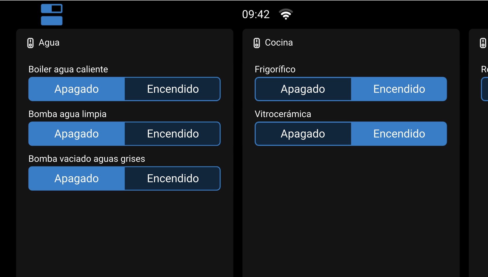
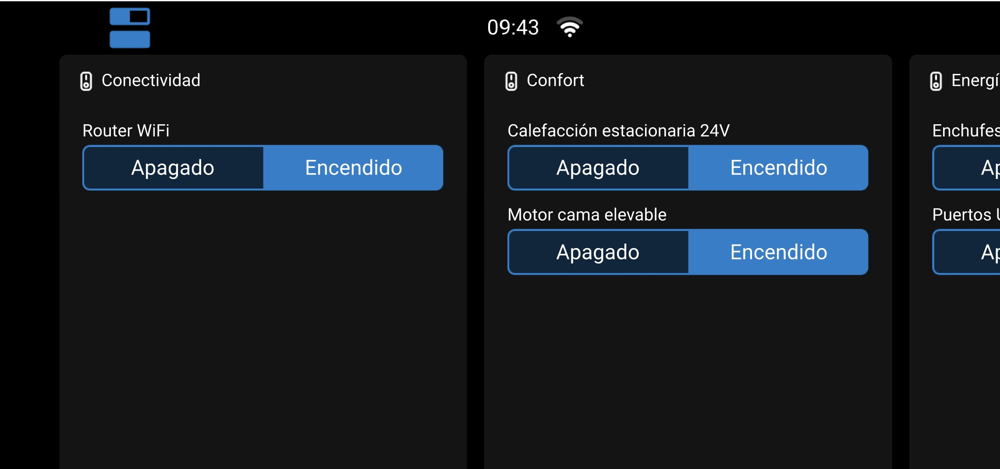
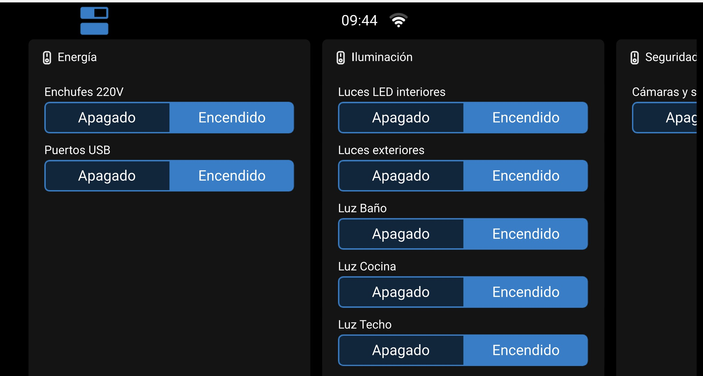

# Dingtian-16relay-Venus-OS-Raspberry-Pi-

Este repositorio contiene la documentación, configuración y archivos necesarios para integrar un **módulo Dingtian DT-R016 (16 relés + 16 entradas digitales)** con una **Raspberry Pi** ejecutando **Venus OS 3.66**, utilizando **MQTT** y el servicio **external-devices**.

El objetivo es que los relés, entradas y sensores del Dingtian se registren en **D-Bus** y puedan controlarse desde la **GUI v2 de Victron** (Ekrano GX, Cerbo GX o Raspberry Pi).
## 🖼️ Capturas de la GUI

Vista de los nuevos botones en la camper:





---

## ✨ Características principales

- Control completo de **16 relés** desde Venus OS GUI v2  
- Lectura de **16 entradas digitales**  
- Integración nativa mediante **D-Bus**  
- Uso del **broker MQTT interno** (puerto 1884)  
- Compatibilidad con **Victron Cerbo GX, Ekrano GX y Raspberry Pi**  
- Menús personalizados con nombres en español en GUI v2  
- Manual detallado y archivo `optionsSet` listo para usar  
- Configuración persistente incluso tras actualizaciones  

---

## 📖 Descripción general

Este repositorio incluye:

- Configuración completa de **MQTT**  
- Fichero `optionsSet` preparado para GUI v2  
- Scripts de instalación y configuración  
- Herramientas de diagnóstico y prueba  
- Manual paso a paso para la integración  

---

## 🚀 Instalación

### 1️⃣ Instalar external-devices (drtinaz)

En la GUI de Victron (Menú → *Package Manager*):

- **Package name**: `external-devices`  
- **GitHub user**: `drtinaz`  
- **Branch**: `main`  

Repositorio oficial: [drtinaz/external-devices](https://github.com/drtinaz/external-devices)

---

### 2️⃣ Configurar el módulo Dingtian

Accede al navegador en la IP del módulo:

http://192.168.1.150

Código

Ajustes MQTT:

- **Broker** → `192.168.1.135` (IP de la Raspberry Pi)  
- **Port** → `1884`  
- **ClientID** → `relay66743`  
- **Username/password** → vacío  

---

### 3️⃣ Crear carpeta de configuración en la Raspberry Pi

```bash
mkdir -p /data/setupOptions/external-devices
nano /data/setupOptions/external-devices/optionsSet
4️⃣ Código de ejemplo optionsSet
Ejemplo completo para un módulo Dingtian DT-R016 (16 relés + 16 entradas):

ini
[Global]
loglevel = INFO
numberofmodules = 1
numberoftempsensors = 1
numberoftanksensors = 3
numberofvirtualbatteries = 1
numberofpvchargers = 1

[MQTT]
brokeraddress = 192.168.1.135
port = 1884
username =
password =

[Relay_Module_1]
serial = 1234567890123456
moduleserial = relay66743
deviceinstance = 1
deviceindex = 0
customname = Módulo principal camper
numberofswitches = 16
numberofinputs = 16
mqtt_on_state_payload = ON
mqtt_off_state_payload = OFF
mqtt_on_command_payload = ON
mqtt_off_command_payload = OFF

[switch_1_1]
customname = Luz Techo
group = Iluminación
mqttstatetopic = /dingtian/relay66743/out/r1
mqttcommandtopic = /dingtian/relay66743/in/r1

[switch_1_2]
customname = Luz Baño
group = Iluminación
mqttstatetopic = /dingtian/relay66743/out/r2
mqttcommandtopic = /dingtian/relay66743/in/r2

... hasta [switch_1_16] ...

[Temp_Sensor_1]
customname = Sensor temperatura interior
type = room
temperaturestatetopic = /dingtian/relay66743/out/temp1

[Tank_Sensor_1]
customname = Depósito agua limpia
fluidtype = fresh water
levelstatetopic = /dingtian/relay66743/out/tank1/level

[Tank_Sensor_2]
customname = Depósito aguas grises
fluidtype = waste water
levelstatetopic = /dingtian/relay66743/out/tank2/level

[Tank_Sensor_3]
customname = Depósito combustible
fluidtype = diesel
levelstatetopic = /dingtian/relay66743/out/tank3/level

[Virtual_Battery_1]
customname = Batería auxiliar camper
capacityah = 200
currentstatetopic = /dingtian/relay66743/out/battery1/current
voltagestatetopic = /dingtian/relay66743/out/battery1/voltage
socstatetopic = /dingtian/relay66743/out/battery1/soc

[Pv_Charger_1]
customname = Cargador solar camper
batterycurrentstatetopic = /dingtian/relay66743/out/pv1/batterycurrent
batteryvoltagestatetopic = /dingtian/relay66743/out/pv1/batteryvoltage
pvvoltagestatetopic = /dingtian/relay66743/out/pv1/pvvoltage
pvpowerstatetopic = /dingtian/relay66743/out/pv1/pvpower
5️⃣ Reiniciar el servicio
bash
svc -t /service/external_devices
Verifica los logs:

bash
tail -n 60 /var/log/external_devices/current
🔧 Pruebas
Ver mensajes MQTT

bash
mosquitto_sub -h 192.168.1.135 -p 1884 -v -t "/dingtian/#"
Activar un relé manualmente

bash
mosquitto_pub -h 192.168.1.135 -p 1884 \
  -t "/dingtian/relay66743/in/r1" -m "ON"
Consultar estado desde D-Bus

bash
dbus -y com.victronenergy.switch.external_1234567890123456 \
  /SwitchableOutput/output_1/State GetValue
🛠️ Requisitos
Componente	Versión / Modelo
Módulo Dingtian	DT-R016 (16CH)
Raspberry Pi	3B / 4B / 5
Firmware Venus OS	≥ 3.66
Servicio	external-devices (drtinaz)

✅ Conclusión
Con este repositorio podrás:

- Integrar un módulo Dingtian DT-R016 en Venus OS.
- Controlar 16 relés y leer 16 entradas digitales desde la GUI v2.
- Añadir sensores de tanque, temperatura, batería virtual y cargador solar.
- Usar MQTT como protocolo de comunicación estándar.

